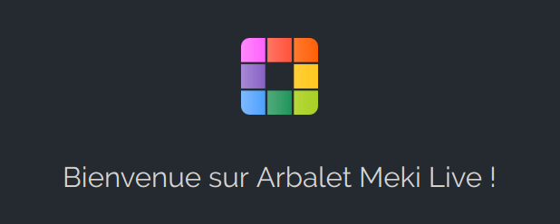
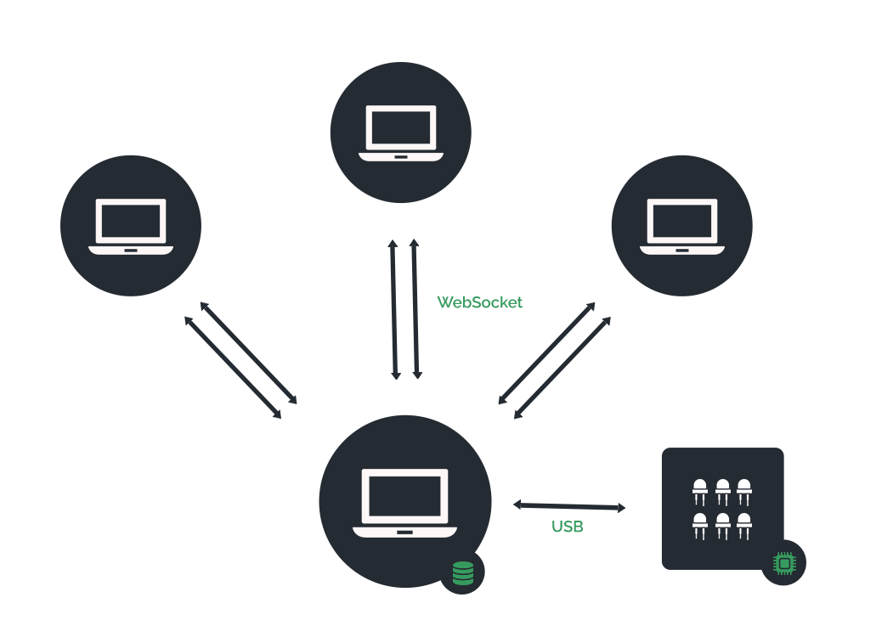

<h1 align="center">
   
  

  Arbalet Meki Live
   
</h1>

<h4 align="center">Documentation développeur</h4>

  <a href="#présentation">Présentation</a> •
  <a href="#schéma">Schéma</a> •
  <a href="#quickstart">Quickstart</a> •
  <a href="#questions">Questions</a> •
  <a href="#troubleshooting">Troubleshooting</a> •
  <a href="#support">Support</a>

# Présentation 
Cette documentation s'adresse aux développeurs

# Schéma 

# Quickstart

# Questions 

# Troubleshooting

# Support

 Website at <a href="http://www.arbalet-project.org/" target="_blank">`arbaletproject.org`</a>

Twitter at <a href="https://twitter.com/arbalet_project" target="_blank">`@arbalet_project`</a>

- Linkedin at <a href="https://www.linkedin.com/company/arbalet/" target="_blank">`arbalet`</a>

- Blog at <a href="http://talk.arbalet-project.org/" target="_blank">`arbalet-blog`</a>

---
